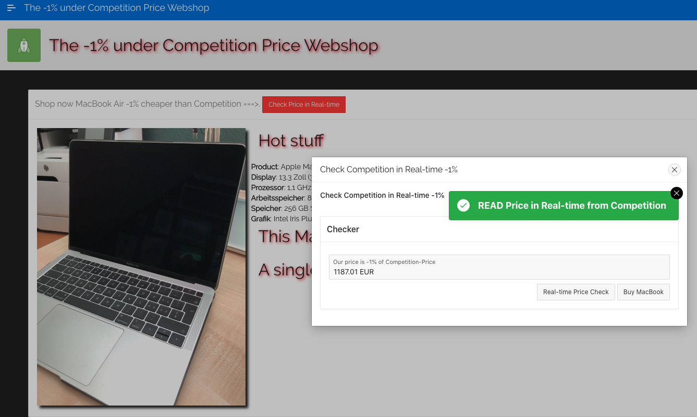

## DISCLAIMER
A variety of laws may apply to unauthorized scraping, including contract, copyright and trespass to chattels laws. (“Trespass to chattels” protects against unauthorized use of someone's personal property, such as computer servers). The fact that so many laws restrict scraping means it is legally dubious. Please be aware that this is only demo case. If you want do something similar, please ask for allowance at website provider.

# Create new business with Confluent Cloud
The idea is very easy. We want to create a webshop which offers products -1% cheaper than the competition.
For this we will use web scraping to check prices of our competition and produce them into Confluent Kafka cluser every 30 seconds.
Based on this data we will create a stream and a table of competition prices. This price check will be integrate via KSQLDB REST API into Web shop.
This github project shows how to implement such a new business MVP in a couple of minutes.



This demo expects some preparation work, before you can execute the scripts. If all the preparation is done, then everything starts automatically:
* confluent cloud cli is installed locally: I tested with v1.8.0
* iterm2 with "install shell integration enables (see iterm2->Install Shell integration)" is installed
* A Confluent Cloud Account is created and active
* An environment in Confluent Cloud have to be created and named in the script `env-vars`
* the python script expects python3 installed and the following packages
```bash
pip3 install requests bs4 confluent_kafka uuid
```

## Pre-Configure
the shell script `env-vars` has some variables which need to fit to your Confluent Cloud environment
* Your Confluent Cloud Environment:  XX_CCLOUD_ENVNAME=new-business
* Your Confluent Cloud Login: XX_CCLOUD_EMAIL=YYYYYYY
* Your Confluent Cloud Password: XX_CCLOUD_PASSWORD=ZZZZZZZZZ
* The name for the Confluent Cluster: XX_CCLOUD_CLUSTERNAME=PRICESCRAPING

## Start the new business MVP
Start the demo
```bash
source env-vars
./00_create_ccloudcluster.sh
```
iterm Terminals with price scraper MVP start automatically. You can login into your Confluent Cloud Account and check in GUI:
* Topic
Note: It will take a while to everything working fine in GUI.

## Prepare KSQL DB App
We will create in KSQL two new objects
* One Stream competitionprices
```bash
CREATE STREAM competitionprices
  (rowkey STRING KEY,
   shop VARCHAR,
   title VARCHAR,
   pricestr VARCHAR,
   pricefloat DOUBLE)
  WITH (KAFKA_TOPIC='competitionprices',
        VALUE_FORMAT='JSON');
```
* One Table competitionprices_table
```bash
CREATE TABLE competitionprices_table AS
  SELECT title as productname, shop, min(pricefloat) AS lowestprice_1minutes
  FROM competitionprices WINDOW TUMBLING (SIZE 1 MINUTES)
  GROUP BY title,shop
  EMIT CHANGES;
```
Please execute these two object in confluent cloud portal ksql editor of your cluster or run ksql cli
```bash
ksql -u APIKEY  -p APISECRET KSQLDB-REST-URL"
ksql> CREATE STREAM competitionprices (rowkey STRING KEY, shop VARCHAR, title VARCHAR, pricestr VARCHAR, pricefloat DOUBLE) WITH (KAFKA_TOPIC='competitionprices',   VALUE_FORMAT='JSON');
ksql> CREATE TABLE competitionprices_table AS SELECT title as productname, shop, min(pricefloat) AS lowestprice_1minutes FROM competitionprices WINDOW TUMBLING (SIZE 1 MINUTES) GROUP BY title,shop EMIT CHANGES;
kqsl> SELECT ROWKEY,productname, shop, lowestprice_1minutes-(lowestprice_1minutes/100) as ourPrice from competitionprices_table emit changes limit 1;
```

## Prepare Oracle Apex Webshop
Create an account in apex.oracle.com. It is free of charge. See [Apex Setup](https://github.com/ora0600/create-new-business-with-confluent-cloud/tree/master/oracle_apex)
Import the Apex app into Oracle Apex (Application Builder).
And create the PL/SQL Function to get the data out of Confluent Cloud Kafka cluster. Please add the correct settings into plsql Function. 

## Stop the new business MVP
To delete the complete environment:
```bash
./02_drop_ccloudcluster.sh
```


